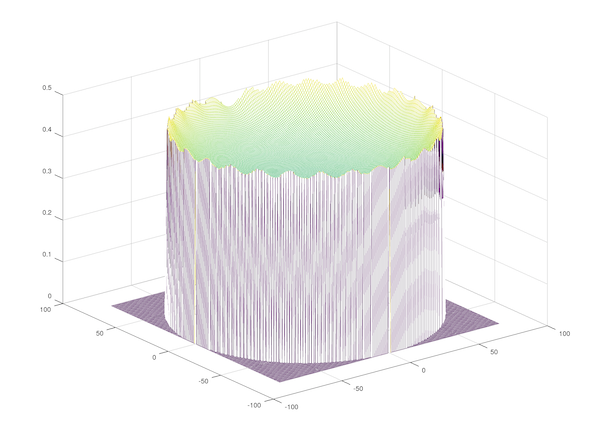

# Circular LED Strip Flat Panel Uniformity Evaluation

I am planning to build a flat field light panel using a circular LED strip placed against a circular wall encircling a diffusing sheet. The LED strip itself would not be directly visible as it would be tucked under a small lip around the top perimeter of the panel. The diffusing sheet would be lit up by the LED strip and would reflect the light back towards to the telescope.

I was wondering how uniform such a panel would be. My expectation is that we should see obvious differences in brightness, especially around the LEDs themselves, even though they would not be directly visible thanks to that small lip.

To find out whether this would even work, I built this GNU Octave simulation. The calculation is pretty complicated. It uses the inverse square law, and also attempts to take into account the directionality of the light beam emitted by a single LED. Here is the result using the default values, which match my telescope:

```bash
$ octave simulator.m
Maximum intensity difference is 15.6%
```



This result is a little surprising and rather pleasing. An acrylic diffuser placed on top of the light panel would probably be enough to get good enough uniformity to get good flats.

As always, you can play with the parameters involved. They are documented in the source file (`simulator.m`)
