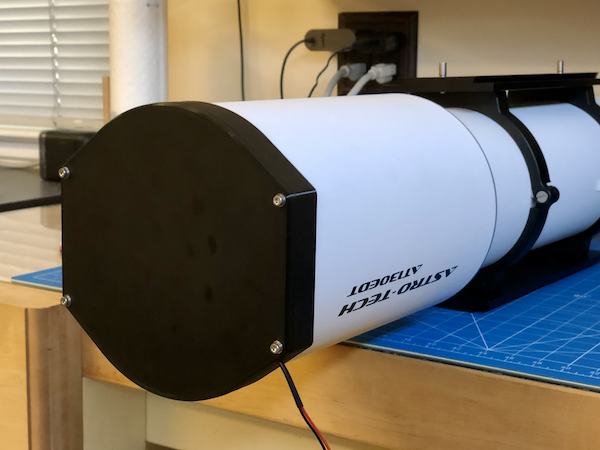
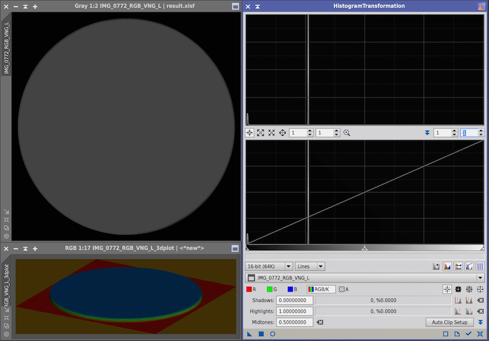

# Circular LED Strip Flat Panel Uniformity Evaluation

- [Introduction](#introduction)
- [Modeling](#modeling)
- [Prototyping](#prototyping)
- [Experimental Measurement Of Uniformity](#experimental-measurement-of-uniformity)
- [Experimental Lambertian Evaluation](#eperimental-lambertian-evaluation)

## Introduction

A [flat frame](https://en.wikipedia.org/wiki/Flat-field_correction) is the most important type of calibration frame used in astrophotography. It allows us to correct issues such as [vignetting](https://en.wikipedia.org/wiki/Vignetting), or remove the impact of dust motes on the filters or the sensor. A common way to capture flat frames is done using a flat panel, which is a uniformly lit surface that can be placed in front of the telescope.

## Modeling

I am planning to build a flat field light panel using an LED strip placed against a wall encircling a diffusing sheet located a few mm below the LED strip. The LED strip itself would not be directly visible as it would be tucked under a small lip around the top perimeter of the wall. The diffusing sheet would be lit up by the LED strip and would reflect the light back towards to the telescope, possibly with one or two layers of a strongly diffusing material.

I was wondering how uniform the light intensity put out by such a panel would be. My expectation is that we should see obvious differences in brightness, especially around the LEDs themselves, even though they would not be directly visible thanks to that small lip.

To find out whether this would even work, I built this GNU Octave simulation. The calculation is pretty complicated. It involves:

* the viewing angle, since LEDs emit a directional beam of light (I use a Gaussian model here, which is just an approximation)
* the inverse square law, since light flux decreases inversely to the square of the distance from the light source
* the angle between the light ray and the background surface — the steeper the angle, the dimmer the point, which is why we have seasons on Earth...

Here is the result using the default values, which match my telescope:

```bash
$ octave simulator.m
Maximum intensity difference is 81.5%
```


This result seems to indicate that this is not a workable solution as-is.

## Prototyping

I built a prototype of this flat panel system anyway, and what you see is, unsurprisingly, a very bright ring that cannot be made into a uniform surface, no matter how many diffusing sheets you place in front of it. Here is a photograph of what that looks like, with a couple of strongly diffusing sheets on top of it:


In order to obtain a more uniform result, we need to look at what manufacturers of flat panel LED TVs do. What we need is to use a Light Guide Panel (LGP), which is usually a sheet of acrylic mixed with reflecting particles, or processed with a laser engraver to precisely create reflecting cavities inside the sheet. It is lit along its edges by the LED strip.

I found a reasonably affordable sheet of this kind of material [here](https://www.inventables.com/technologies/light-guide-acrylic-sheet). You may also purchase a light panel, and tear it down to get that component.

I wanted to try out an LGP so I ordered the [Taloya LED Flush Mount Ceiling Light](https://www.amazon.com/dp/B08GX81JB1) ($20) on Amazon, opened it up, and recovered the LGP as well as the white background. I did not use anything else from it. Then, I cut the LGP and a piece of 3mm thick white translucent acrylic I had from a previous project using a scroll saw, and I cleaned those up at the router table with a circular template for a perfect fit and finish. I also cut the white background using a pair of scissors. I did not reuse the diffuser from the light fixture because I thought it was not diffusing enough. Finally, I 3D printed a mount for it that could eventually be integrated with my robotic lens cap. Below are a few photos of the project. The LED strip is a $14 "high density" LED strip I bought on Amazon [[link](https://www.amazon.com/dp/B07X53HXY1)].

The LGP nicely distributing the light emitted by the LED strip across the entire surface:


With the acrylic diffusing sheet (itself sitting a few mm above the LGP):


The completed unit:


Test fitting the unit to my telescope (AT130EDT):



## Experimental Measurement Of Uniformity

Using my DSLR camera, I took the following photograph of my light panel prototype, in a dark room, to estimate its uniformity.

**Notes:**

* I captured the image in RAW format.
* I took a relatively long exposure (~300 msec) to avoid seeing the effect of the PWM signal, which is very visible in the live view.
* I made sure that the peak of the histogram was around 20-30% to stay within the linear range of the sensor.
* I looked at the data with PixInsight. I simply debayered the image, and then extracted the CIE L* component, so we are looking at a grayscale image.

Here is what I get, with the panel intensity set at ~ 50%:



This shows that **the panel is uniform within 0.5%!** Honestly, I don't think that a flat panel, located only inches away from the objective lens, needs to be all that uniform, but wow, this is amazing!

## Experimental Lambertian Evaluation

A good flat panel should not only be uniform, it should also be [Lambertian](https://en.wikipedia.org/wiki/Lambert%27s_cosine_law) in order for the irradiance to match the sky background. Any directionality to the light may impact calibration. I measured the impact of the angle between the flat panel surface and the line of sight on the measured intensity. I did it in 5° increments, from 0° to 45°. Here are 3 of those 10 images, as an example of what I did:


I imported the 10 raw images I captured in PixInsight, debayered them, extracted the luminance channel, batch cropped them to extract the same center portion of the flat panel, and used the `ImageStatistics` process on each resulting image to extract the median value. The result is captured in the following chart:


This shows that the measured brightness decreases by as much as 5% when the panel is oriented at a 45° angle compared to when it is directly facing the camera. It looks relatively flat up to 15° (so, that would be a 30° cone of light) before it starts to decrease (any variations within that range is probably within the margin of error). So there does seem to be _some small amount_ of directionality, i.e. it is not perfect, but 5% is fairly good. The directionality may be caused by the way that specific LGP is manufactured. Other LGPs use particles embedded in an acrylic sheet, and I would expect those to be more "Lambertian"...
